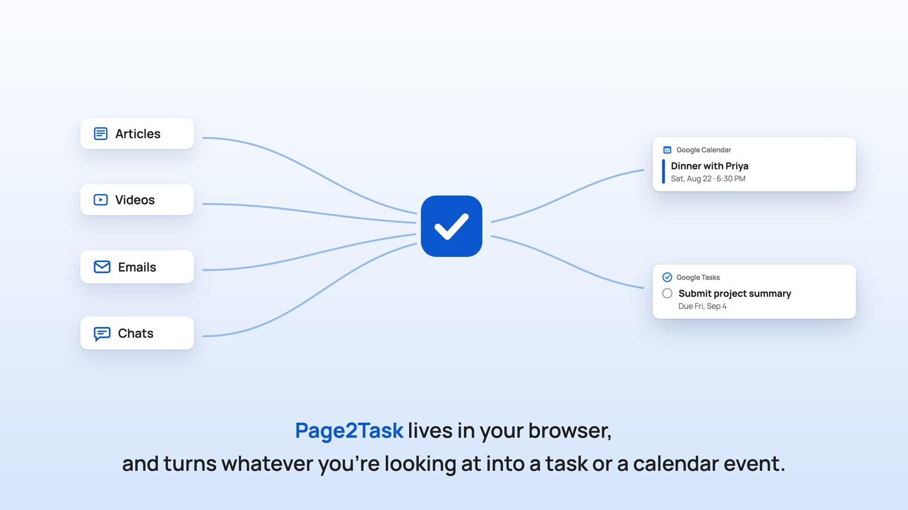

# Page2Task

A Chrome extension that turns whatever you're looking at into a **Google Task** or a **Google Calendar event**.

[](https://www.youtube.com/watch?v=Cb1pTa6Fqco)

Open a page, an email, or paste a screenshot. Page2Task finds the deadline, title, and location, and saves it to your own Google account.

## Install

**[Add it from the Chrome Web Store](https://chromewebstore.google.com/detail/page2task/ceidkihpjbnbekklighmhcpabpbcjlff)** and you're done: connect your Google account when asked (the app is verified by Google) and start saving. Your first 30 AI reads are free, no key and no setup.

<details>
<summary>Install from source instead</summary>

1. Download this repo (or clone it) and unzip.
2. Open `chrome://extensions` in Chrome.
3. Turn on **Developer mode** (toggle, top right).
4. Click **Load unpacked** and select the `page2task` folder.

Keep the folder where it is: Chrome loads an unpacked extension from that location.
A source install behaves exactly like the store version, free trial included.
</details>

## What it does

- **Gmail** — reads the whole open thread and pulls out deadlines and appointments, even when the date is buried in an earlier message
- **Any web page** — event pages, forms, syllabi: the visible text is read and the deadlines extracted
- **Screenshots** — paste one with ⌘V (a chat, a poster, a form) and the AI reads the to-do out of the image
- **Pasted text** — drop in any message or invite and it gets parsed
- **Several deadlines at once** — every deadline found gets a checkbox; tick the ones you want and each becomes its own task or event, with its own date, time, location, and task list
- **To-do / Calendar / Both** — pick at the top; the form shows only the fields that mode needs
- **Locations** go into the calendar event's real location field, not the notes
- **Task lists** — the AI suggests which of your Google Tasks lists each item belongs in; you can change it per item
- **Videos** — reads the video's real length and sizes the calendar block to match

## AI recognition (optional)

Page2Task works with no setup at all: built-in rules detect dates locally, offline and free.

For better titles and screenshot reading, it uses AI. The options, in the order new installs get them:

| Tier | Cost | Setup |
|---|---|---|
| **Free trial** (default) | First 30 reads free, on the developer's dime | None. Requests go through a small relay at `page2task.sherryshen.world` that forwards them to OpenAI and keeps nothing |
| **Your own API key** | Google Gemini has a free tier; Claude, OpenAI, and Kimi are pay per use, well under 1c per run | Paste a key in Settings |
| **Chrome's built-in AI** (Gemini Nano) | Free, unlimited | One-time ~2 GB model download offered in the popup; runs entirely on your computer |
| **Local rules** | Free | Always available as the fallback when AI errors out |

**API keys are stored only on the computer you type them on** (never synced to your
Google account) and are sent only to the provider they belong to. The developer never
sees them. Note for source installs: the free trial also runs on the developer's
OpenAI credits, so if you fork this for real use, please switch to your own key
(Settings) or point `HOSTED_URL` in `lib/ai.js` at your own relay (`docs/api/extract.js`).

## Privacy

- No analytics, no tracking, nothing stored server-side. The only server involved is the optional free-trial relay, which forwards a request and keeps nothing. See the [privacy policy](https://page2task.sherryshen.world/privacy.html).
- Page content is read only when you click the extension icon.
- Tasks and events go directly from your browser to Google's official APIs.
- What you analyze is sent to the AI option you chose (the free-trial relay, or your own provider), together with your account email so meetings in a conversation are titled with the other person's name. With Chrome's built-in AI, nothing leaves your computer at all.

## Settings

- **AI provider** — the free on-device model, or Gemini, Claude, OpenAI, or Kimi with a key field for each, plus a test button
- **Google account** — shows the connected account; **Disconnect** to switch
- **Default event duration** — used when an event has a start time but no natural length

## For developers

No build step, no framework, no npm install — vanilla JS throughout.

```bash
node --test test/*.test.mjs
```

After editing, hit the reload icon on the extension card in `chrome://extensions`.

| File | Purpose |
|---|---|
| `popup.html/css/js` | The popup: mode switch, import zone, candidate checkboxes, per-item cards |
| `background.js` | Service worker: Google API writes survive the popup closing, with job replay |
| `pageAnalyzer.js` | Injected page analyzer: email / video / article / PDF detection, page text |
| `lib/dateparse.js` | Local rule-based date extraction (English + Chinese), multi-candidate |
| `lib/vendor/chrono.js` | Bundled [chrono-node](https://github.com/wanasit/chrono) date parser (MIT) |
| `lib/google.js` | Google Tasks / Calendar API wrapper |
| `lib/ai.js` | AI extraction: hosted free trial, built-in Gemini Nano, Gemini, Claude, OpenAI, Kimi; text & vision |
| `docs/api/extract.js` | The free-trial relay (a Vercel function): Google-token gated, forwards one request to OpenAI |
| `options.html/js` | Settings page |

Forking with your own Google Cloud project? Copy `manifest.template.json` over
`manifest.json` and follow **[SETUP.md](SETUP.md)** (中文: [SETUP.zh-CN.md](SETUP.zh-CN.md)).

## Credits

- [chrono-node](https://github.com/wanasit/chrono) (MIT) — natural-language date parsing.

## License

[MIT](LICENSE)
